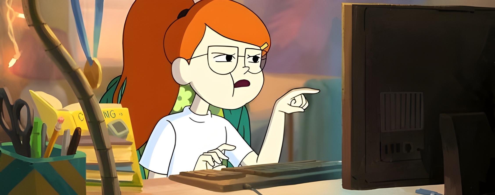
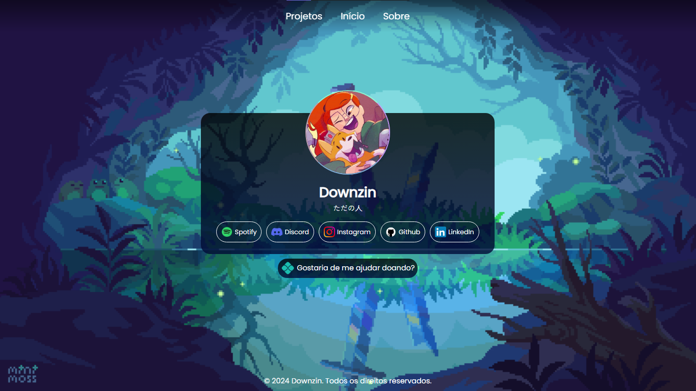

  <h1>✨ Projeto Downzin.me 私の 👾</h1>
  
 Um projeto para reunir links das minhas redes sociais e criar uma página com uma breve biografia, destinada aos visitantes. Além disso, a página apresentará alguns dos meus projetos favoritos.  <strong>(¬‿¬)</strong>

  

    
  

<section align="center">
  <h2>✨ Linguagens & Tecnologias Usadas 知識</h2>
  

    
    
    
      
  

</section>

  <h2>💻 Preview プレビュー</h2>
  
   
  

---
<section align="center">
  
😀 Se você tiver sugestões, feedback ou quiser colaborar em algum projeto, ficarei feliz em ouvir de você! 😁

  <h3>💻 Contato 接触</h3>
  

    
    
    
    
  

</section>